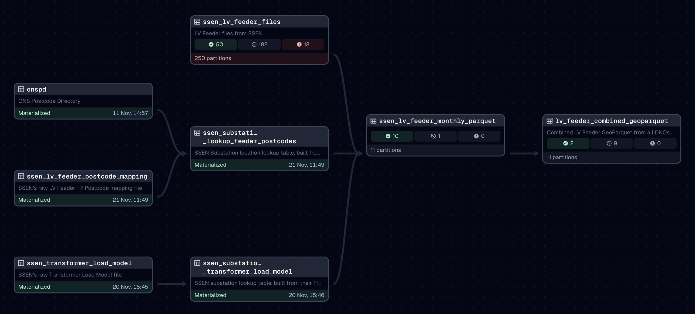

# Contributing to Weave
Thank you for your interest in contributing to Weave!

We're trying to unlock energy data, so that people can bring the power of machine
learning and artificial intelligence to bear on climate problems. There are lots of ways
you can help, beyond just writing code, but there's also lots of code that needs
writing too!

## Ways to contribute
Some things we'd love to see:
- Use and improve this documentation
- Run a hackathon, 10% day or use some "innovation time" to get more people familar with
  the data and explore its uses.
- Find something fascinating in the data and visualise it to demonstrate its value
- Sense check and quality control the data - help us understand where it's out of
  bounds, missing, or otherwise wrong - so we can improve it
- Check out our [issues](https://github.com/centre-for-ai-and-climate/weave/contribute)
  for something we want to add or improve.

If you're unsure, please do reach out to us


## Getting started with the code
Weave is almost exclusively written in Python and we use
[UV](https://docs.astral.sh/uv/getting-started/installation/) to manage our Python
dependencies. We like it because it's an all-in-one tool - there's no need to install
stuff separately, create virtualenvs or manage python versions - we can specify
everything in code and UV will manage everything.

Therefore, in order to get set up for local development, you first need to
[install UV](https://docs.astral.sh/uv/getting-started/installation/). Once that's
installed, you can run any UV command to initialise everything.

e.g. start the local Dagster UI web server in development mode:

```bash
uv run dagster dev
```

Open http://localhost:3000/asset-groups with your browser, you should see something
like:



### Secrets & Configuration
Python dependencies are not sufficient to actually download all of the data we use,
because some of our sources require authentication. These secrets are provided via
environment variables, loaded from a `.env` file.

We provide an example file you can copy, with instructions on where to obtain the
necessary API keys and how to configure other settings.

```bash
cp .env.example .env
```

### Materialising assets
Our data pipeline models the data as "assets" in Dagster's terminology. We recommend
[their tutorial](https://docs.dagster.io/tutorial/introduction) if you're new to it. In
a nutshell though, each "asset" is a data output - in our case a file on disk or in an
S3 bucket.

In order to get data locally, you need to "materialise" those assets. In production,
we make use of Dagster's Sensors and Automation Conditions to make this automatic, but
when running locally, those are disabled by default - you don't always want 100s of GB
of data downloaded! Therefore, we recommend that (at least initially) you materialise
assets manually (through the UI) to get what you want.

The image above is a graph showing the dependencies of each asset, from "upstream"
assets on the left through to "downstream" assets on the right. You need to start with
the upstream assets, but you don't necessarily need to get everything, depending on what
you want. Dagster's UI will tell you if you are missing a required downstream asset.

## Development
If you'd like to contribute to Weave's code, it will help to have an idea of how we've
structured it and how we like to work.

### Code overview
A brief overview of the folder structures and main code locations in the project:

```
| .dagster              # Dagster config and local dev persistent storage
| .github               # Github actions for CI/CD
| .vscode               # Shared VSCode settings
| adrs                  # Architectural decision records
| data                  # Local dev asset output
    | output            # Final output files
    | raw               # Un-altered downloads from sources
    | staging           # Intermediate files
| docs                  # Documentation
| experiments           # Python notebooks for various one-off scripts and explorations
| weave                 # Main Dagster pipeline
    | assets            # Dagster Assets
    | resources         # Dagster Resources (API clients, etc)
    | core.py           # Domain objects (not Dagster specific)
    | definitions.py    # Dagster configuration / plumbing
    | sensors.py        # Dagster Sensors
| weave_tests           # Tests
    | fixtures          # Test fixture files
```

### Development environment
We use VSCode, so there are some additional vscode settings included in the repo, but
this is primarily to help integrate our testing and linting setup.

Whatever IDE or editor you use, the primary thing to be aware of is that we lint and
format our Python code with [Ruff](https://astral.sh/ruff), so it will probably help
avoid problems if you have that run automatically in your environment too.

### Adding new Python dependencies
As mentioned above, we use UV to manage our python environment, so that's as simple as

```bash
uv add dependency-name
```

Note that we use UV's feature for segregating development dependencies, so that we can
keep our production environment lean. In other words, if you need to install something
only for dev or testing, do:

```bash
uv add --dev dependency-name
```

### Testing
Tests are in the `weave_tests` directory and you can run tests using `pytest`:

```bash
uv run pytest weave_tests
```

In general we try to make sure there are unit tests for each Asset, Resource and Client.
We use a dependency injection approach over mocking wherever possible, e.g. having
API clients implement an abstract class and providing a configurable test
implementation as well as a "live" one.

We have an outstanding TODO to add more fully featured integration tests, ideally
involving the dagster development server, but mocking/stubbing external resources in
that environment seems tricky.

### ADRs
We try to record major decisions we've made in the form of Architectural Decision
Records. These are found in the `adrs` directory, often as executable Jupyter notebooks
which should run in the default `uv` venv (with development dependencies).

## Deployment
The main branch is automatically deployed to dagster.io's serverless cloud hosting
through our Github actions.

Pull requests are deployed to a "branch deploy" where they can be tested independently,
they get a dedicated prefix in a staging S3 bucket in which to work, that is then torn
down when the PR is closed or merged.
