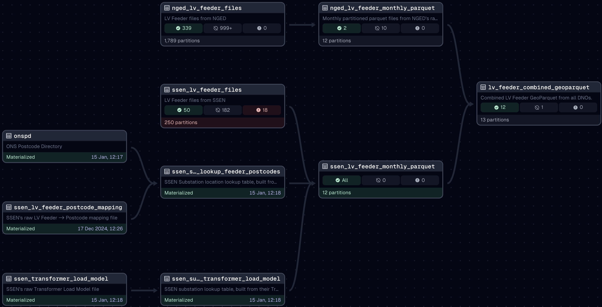

# Weave
We unlock energy data: https://weave.energy

This repository holds the data pipeline and technical documentation for Weave, a project
by [the Centre for AI and Climate](https://www.c-ai-c.org/) and
[CEIMIA](https://ceimia.org).Our mission is to accelerate the application of artificial
intelligence and machine learning to climate problems. To do this, we're trying to
improve access to valuable energy datasets, starting with granular smart meter data from
UK electricity distribution network operators (DNOs). This dataset is valuable because
it's the largest and most granular dataset of real domestic energy consumption anywhere
in the world. We think it can help understand and potentially predict electricity demand
in novel ways.

We have previously released
[prototype code](https://github.com/centre-for-ai-and-climate/lv-feeder-smart-meter-data)
for working with this data, but this repo represents our attempt to make that into a
more "production-ready" data pipeline. Importantly, this is also an open-source project
and we welcome external contributions.

## How do I get the data?
You do not need to run this code to get the data, this repository is the data pipeline
that builds GeoParquet files and uploads them to our Amazon S3 bucket. Data is freely
available from there, see https://weave.energy or
[the examples in our docs](docs/smart-meter-examples.ipynb) for more details.

## Running the code
If, however, you want to run the data pipeline locally, to contribute to it, or to build
your own cache of DNO data, you are in the right place.

We use [UV](https://docs.astral.sh/uv/getting-started/installation/) to manage our
Python dependencies. We like it because it's an all-in-one tool - there's no need to
install stuff separately, create virtualenvs or manage python versions - we can specify
everything in code and UV will manage everything.

Therefore, in order to get set up for local development, you first need to
[install UV](https://docs.astral.sh/uv/getting-started/installation/), then run any
UV command to initialise everything.

e.g. start the local Dagster UI web server in development mode:

```bash
uv run dagster dev
```

Open http://localhost:3000/asset-groups with your browser, you should see something
like:



### Secrets & Configuration
Python dependencies are not sufficient to actually download all of the data we use,
because some of our sources require authentication. These secrets are provided via
environment variables, loaded from a `.env` file.

We provide an example file you can copy, with instructions on where to obtain the
necessary API keys and how to configure other settings.

```bash
cp .env.example .env
```

### Materialising assets
Our data pipeline models the data as "assets" in Dagster's terminology. We recommend
[their tutorial](https://docs.dagster.io/tutorial/introduction) if you're new to it. In
a nutshell though, each "asset" is a data output - in our case a file on disk or in an
S3 bucket.

In order to get data locally, you need to "materialise" those assets. In production,
we make use of Dagster's Sensors and Automation Conditions to make this automatic, but
when running locally, those are disabled by default - you don't always want 100s of GB
of data downloaded! Therefore, we recommend that (at least initially) you materialise
assets manually (through the UI) to get what you want.

The image above is a graph showing the dependencies of each asset, from "upstream"
assets on the left through to "downstream" assets on the right. You need to start with
the upstream assets, but you don't necessarily need to get everything, depending on what
you want. Dagster's UI will tell you if you are missing a required downstream asset.

## Development

### Code overview
A brief overview of the folder structures and main code locations in the project:

```
| .dagster              # Dagster config and local dev persistent storage
| .github               # Github actions for CI/CD
| .vscode               # Shared VSCode settings
| adrs                  # Architectural decision records
| data                  # Local dev asset output
    | output            # Final output files
    | raw               # Un-altered downloads from sources
    | staging           # Intermediate files
| docs                  # Documentation
| experiments           # Python notebooks for various one-off scripts and explorations
| weave                 # Main Dagster pipeline
    | assets            # Dagster Assets
    | resources         # Dagster Resources (API clients, etc)
    | core.py           # Domain objects (not Dagster specific)
    | definitions.py    # Dagster configuration / plumbing
    | sensors.py        # Dagster Sensors
| weave_tests           # Tests
    | fixtures          # Test fixture files
```

### Adding new Python dependencies
As mentioned above, we use UV to manage our python environment, so that's as simple as

```bash
uv add dependency-name
```

Note that we use UV's feature for segregating development dependencies, so that we can
keep our production environment lean. In other words, if you need to install something
only for dev or testing, do:

```bash
uv add --dev dependency-name
```

### Unit testing

Tests are in the `weave_tests` directory and you can run tests using `pytest`:

```bash
uv run pytest weave_tests
```

In general we try to make sure there are unit tests for each Asset, Resource and Client.
We use a dependency injection approach over mocking wherever possible, e.g. having
API clients implement an abstract class and providing a configurable test
implementation as well as a "live" one.

We have an outstanding TODO to add more fully featured integration tests, ideally
involving the dagster development server, but mocking/stubbing external resources in
that environment seems tricky.

### ADRs
We try to record major decisions we've made in the form of Architectural Decision
Records. These are found in the `adrs` directory, often as executable Jupyter notebooks
which should run in the default `uv` venv (with development dependencies).

## Deployment
The main branch is automatically deployed to dagster.io's serverless cloud hosting
through our Github actions.

Pull requests are deployed to a "branch deploy" where they can be tested independently,
they get a dedicated prefix in a staging S3 bucket in which to work, that is then torn
down when the PR is closed or merged.
