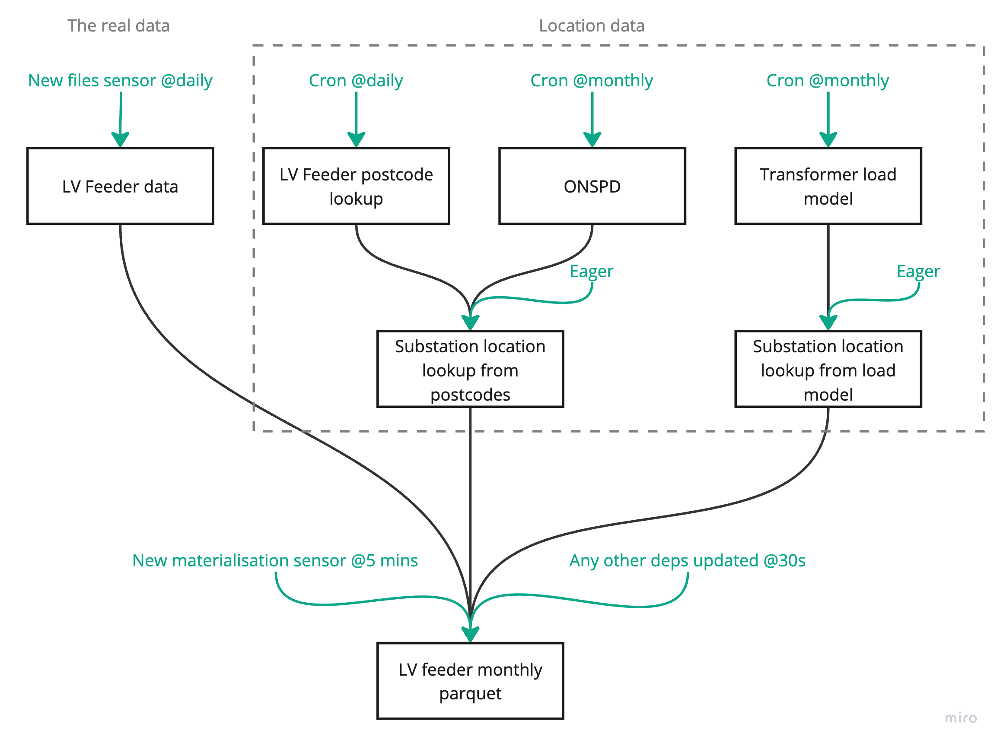

# SSEN asset automation architectural decision record

The problem: how do we manage the various different dependencies for our SSEN LV Feeder
data, now that we have at least four different raw sources of data, to make sure that
the ultimate outputs are always up to date.

All of our inputs are updated on schedules outside of our control:
- LV Feeder data is updated whenever SSEN want to - usually daily-ish
- LV Feeder postcode lookup data is also whenever SSEN want to - presumably on a similar
  schedule to the main data, but it's hard to tell
- ONSPD is updated quarterly
- Transformer load model is very rarely (last update 5 months ago)

For the feeder data itself, we always want to be up to date, so we've built custom
sensors which check and update the raw data every day, then rebuild the relevant
monthly partitions as soon as any new materialisations are recorded. (In ADR 0001 I
examined various ways to manage downloading, which became superseded by this approach of
using Dagster's partitions and sensors).

This approach is fine when we are just consuming one data source from the DNO, but now
we also need to react to changes in the location data it's trickier. When SSEN publish
new postcodes linked to feeders, or when ONSPD updates, it could affect the locations of
any of our substations. To make those changes, we need to trigger the materialisation
of multiple downstream assets and then coordinate those to update the monthly partition
files getting update.

Ideally we would rebuild all of our monthly data whenever any of these upstream
assets changes.

## Approaches

### Declarative automation
Dagster allow you to declare "automation conditions" that manage when assets are
automatically materialized. [Their RFC](https://github.com/dagster-io/dagster/discussions/22811)
describes pretty well how that is supposed to work - you can use their built-in
primitives for simple cases, but also combine them in boolean logic to make custom
conditions: https://docs.dagster.io/concepts/automation/declarative-automation/customizing-automation-conditions.

This seems like the best approach as Dagster has done a lot of hard work for us, but
it's not immediately clear how to marry it with our existing sensors. It is also very
new, so carries Dagster's "experimental" warning.

### Sensors
[Sensors](https://docs.dagster.io/concepts/partitions-schedules-sensors/sensors) are
another Dagster feature, which we already use. They say they are intended for instigating
runs on external state changes, but can also be used to look at internal Dagster state
as we currently do for monthly partitions (and this seems at least somewhat condoned
through support examples).

This approach is very flexible, but also complex and would involve us having to maintain
quite a lot of internal state and rebuild a lot of the logic provided by the declarative
automation framework. For example, being able to wait for assets that are in progress
or retrying on failure

### Schedules
Finally, we could use simpler cron-based scheduling and carefully schedule runs so
that assets are correctly updated.

This approach seems quite fragile and not very scalable - if one asset took longer to
run, or failed, everything would fall down.

## Decision
Dagster's automation conditions are so close to what we need for much of our use-case
that it seems to make sense to use them. I have experimented and arrived at a hybrid
approach which seems to combine with our existing sensors okay:

In this, we use automation conditions to make sure our location lookup tables are up to
date, and then to update the monthly parquet files when _those_ update. By excluding the
raw data from the automation condition's consideration, we allow both the sensor and
the automation to update the files but not overlap in their concerns.

This could still result in quite a bit of churn in our data when multiple inputs are
updated in close succession, but for now that is acceptable. We can add additional time
window constraints to the automation in the future if we want to reduce how much data it
rebuilds.